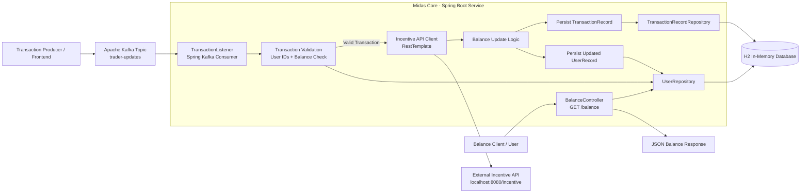
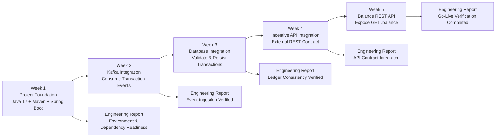
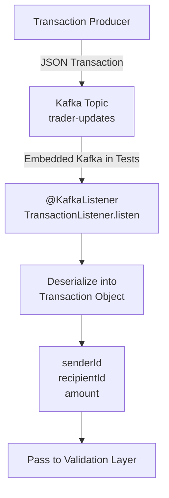
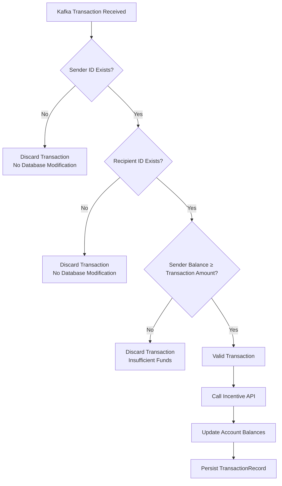
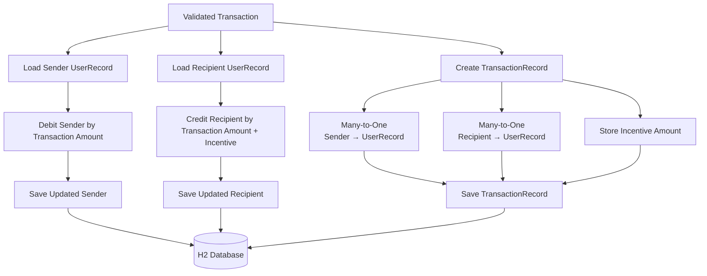

<div align="center">

# 🏦 MidasCore 💱
### Enterprise Event-Driven Financial Transaction Processing Service

<p align="center">

<!-- Core Stack -->


<!-- APIs -->


<!-- Messaging -->


<!-- Persistence -->


<!-- Engineering Concepts -->


<!-- Testing -->


</p>


</div>

---

# About

MidasCore is an **enterprise-inspired financial transaction processing service** developed as part of the **JPMorgan Chase Software Engineering Virtual Experience** hosted by **Forage**.

The simulation recreates the responsibilities of a backend software engineer working on an event-driven financial platform. Throughout five iterative engineering sprints, the project evolves from a basic Spring Boot application into a complete transaction processing service capable of consuming events from Apache Kafka, validating financial transactions, persisting them to a relational database, integrating with external REST services, and exposing customer-facing APIs.

Rather than focusing solely on implementation, the simulation emphasizes how modern financial systems are architected using loosely coupled services, asynchronous communication, relational persistence, and clearly defined API contracts between independent engineering teams.

The completed application demonstrates a simplified but representative banking workflow:

- Transaction ingestion through Apache Kafka
- Financial validation using business rules
- Persistent transaction ledger
- External incentive calculation service
- REST API exposing customer balances
- Layered Spring Boot architecture
- Enterprise integration testing

Although intentionally simplified for educational purposes, the technologies, architectural patterns, and engineering decisions closely resemble those commonly used in modern financial backend systems.

---

# Learning Outcomes

This project demonstrates practical experience with enterprise backend engineering concepts, including:

- Designing event-driven systems using Apache Kafka
- Consuming asynchronous messages with Spring Kafka
- Implementing business validation logic
- Modelling relational entities with JPA/Hibernate
- Persisting transactional data using Spring Data repositories
- Integrating external REST APIs using RestTemplate
- Designing layered Spring Boot applications
- Exposing REST endpoints for downstream consumers
- Applying dependency injection throughout the application
- Understanding service boundaries between distributed systems
- Performing integration testing with embedded Kafka
- Building maintainable backend services following enterprise software architecture principles

---

# Technology Stack

| Category | Technologies |
|-----------|--------------|
| Language | Java 17 |
| Framework | Spring Boot 3.2.5 |
| Messaging | Apache Kafka |
| Persistence | Spring Data JPA, Hibernate |
| Database | H2 In-Memory Database |
| REST | Spring MVC, RestTemplate |
| Build Tool | Maven |
| Testing | JUnit 5, Embedded Kafka |
| Architecture | Event-Driven Microservice |
| Serialization | Jackson JSON |

---

# Enterprise Architecture Overview

MidasCore operates as the transaction processing component within a larger distributed financial platform.

Incoming transactions are produced by upstream services and published onto a Kafka topic. MidasCore consumes these events asynchronously, validates each transaction, communicates with an external Incentive Service, updates customer balances, records the completed transaction, and finally exposes current account balances through a REST endpoint.

This architecture demonstrates several common enterprise software engineering principles:

- Loose coupling through asynchronous messaging
- Independent microservice communication
- Database-backed transaction processing
- Separation of responsibilities
- Externalized business logic
- Layered backend architecture

---

# Overall System Architecture



The architecture follows an event-driven processing pipeline:

1. Transactions are published onto Kafka.
2. MidasCore consumes incoming events.
3. Business validation rules determine transaction validity.
4. Incentive calculations are delegated to an external REST service.
5. Updated balances are persisted within the relational database.
6. Customer balances become available through REST APIs.

This separation allows each subsystem to evolve independently while communicating through well-defined interfaces.

---

# Five-Week Sprint Delivery Pipeline



The virtual experience is organized as five engineering sprints that progressively deliver production-style backend capabilities.

| Sprint | Primary Objective |
|---------|-------------------|
| Week 1 | Environment setup and Spring Boot foundation |
| Week 2 | Kafka integration and asynchronous messaging |
| Week 3 | Database persistence and transaction validation |
| Week 4 | External Incentive API integration |
| Week 5 | Customer-facing REST balance service |

Each sprint builds directly upon the previous week's deliverables, reflecting an iterative software delivery lifecycle similar to Agile development practiced across enterprise engineering teams.

---

# High-Level Codebase Overview



The application consists of several independent layers that collaborate to process financial transactions.

## Kafka Layer

Responsible for asynchronously receiving incoming transactions from the configured Kafka topic.

**Primary Component**

- `TransactionListener`

**Responsibilities**

- Consume Kafka messages
- Deserialize JSON into `Transaction` objects
- Trigger the transaction processing workflow

---

## Business Logic Layer

Contains validation rules that determine whether incoming transactions should be processed.

Validation Rules:

- Sender exists
- Recipient exists
- Sender possesses sufficient funds

Only valid transactions continue through the processing pipeline.

---

## Persistence Layer

Responsible for storing application state.

Entities:

- UserRecord
- TransactionRecord

Repositories:

- UserRepository
- TransactionRecordRepository

Spring Data JPA abstracts database operations, allowing the underlying database technology to change with minimal application code changes.

---

## External Service Layer

MidasCore integrates with an independent Incentive API through REST.

Instead of embedding incentive logic directly into transaction processing, responsibilities remain separated across two independent services connected through an API contract.

This demonstrates one of the most important architectural principles in distributed systems:

> Independent teams can modify their services without impacting one another as long as the API contract remains stable.

---

## REST Layer

The BalanceController exposes customer balances through a lightweight REST endpoint.

Example:

GET

```
/balance?userId=5
```

Response

```json
{
    "amount":1326.98
}
```

If a customer cannot be found:

```json
{
    "amount":0.0
}
```

This REST layer allows downstream systems—including mobile applications, online banking portals, and internal banking tools—to retrieve account balances without requiring direct database access.

# Week-by-Week Sprint Deliverables

The MidasCore project was completed through **five iterative engineering sprints**, each introducing a major capability commonly found within enterprise financial systems.

Rather than implementing the entire platform at once, functionality was delivered incrementally, allowing each feature to be validated before introducing additional complexity. This mirrors Agile software development practices commonly used within large engineering organizations, where every sprint concludes with implementation, testing, code review, and stakeholder reporting.

---

# Week 1 — Project Foundation & Environment Setup

<p align="center">

</p>

## Sprint Objective

Establish the development environment and prepare the application for future transaction-processing capabilities.

This sprint focused entirely on creating a stable engineering foundation by configuring the Spring Boot project, resolving dependencies, and ensuring that the application could successfully build, start, and execute automated verification tests.

---

## Engineering Responsibilities

- Fork and clone the project repository
- Configure Java 17 development environment
- Configure Maven project structure
- Install required Spring Boot dependencies
- Configure application properties
- Verify successful application startup
- Validate build pipeline through automated testing

---

## Technical Implementation

During this sprint, the following enterprise technologies were integrated:

- Spring Boot 3.2.5
- Spring Data JPA
- Spring Web
- Spring Kafka
- Embedded Kafka Testing
- H2 Database
- Testcontainers Kafka
- Maven dependency management

Application configuration was externalized into:

```yaml
application.yml
```

where the Kafka topic configuration was introduced:

```yaml
general:
  kafka-topic: trader-updates
```

Externalizing configuration rather than hardcoding values is a common enterprise practice that allows applications to be deployed across multiple environments without requiring code changes.

---

## Deliverables

- Java 17 configured
- Spring Boot application builds successfully
- Maven dependency resolution completed
- Application configuration externalized
- Automated verification tests passed

---

## Engineering Report

During Sprint 1, the software engineering effort centred around establishing a reliable development environment suitable for future feature implementation.

Configuration issues involving Java compatibility, Maven dependency resolution, and Spring Boot initialization were resolved to create a stable baseline from which subsequent features could be developed.

At the conclusion of the sprint, the application successfully initialized and completed the provided verification tests, confirming that the development environment was correctly configured.

---

## Sprint Outcome

✅ Spring Boot environment established

✅ Build pipeline operational

✅ Dependency management completed

✅ Configuration externalized

---

# Week 2 — Event-Driven Transaction Processing

<p align="center">

</p>

<p align="center">

</p>

## Sprint Objective

Integrate Apache Kafka into MidasCore, enabling asynchronous transaction ingestion.

Rather than receiving synchronous HTTP requests, MidasCore now consumes financial transactions from an enterprise messaging platform.

---

## Engineering Responsibilities

- Integrate Apache Kafka
- Configure Spring Kafka consumer
- Consume Transaction objects directly
- Configure a configurable Kafka topic
- Validate successful message deserialization
- Verify asynchronous processing through automated testing

---

## Technical Implementation

A dedicated Kafka consumer was introduced using Spring's annotation-driven messaging model.

```java
@KafkaListener(
    topics="${general.kafka-topic}",
    groupId="midas-core"
)
```

Incoming JSON payloads are automatically deserialized into strongly typed Transaction objects using Spring Boot's built-in Jackson integration.

The consumer intentionally performs no business processing during this sprint.

Its sole responsibility is receiving and deserializing transaction events, allowing future business logic to be layered on without modifying the messaging infrastructure.

---

## Architectural Benefits

Introducing Kafka provides several advantages commonly leveraged within enterprise financial systems.

### Loose Coupling

Transaction producers no longer require knowledge of downstream processing services.

---

### Scalability

Multiple transaction producers and consumers can independently scale as transaction volumes increase.

---

### Fault Tolerance

Transactions remain queued while backend services recover from temporary failures.

---

### Asynchronous Processing

Customer requests can continue being accepted even when downstream services are under heavy load.

---

## Deliverables

- Kafka consumer implemented
- Transaction deserialization completed
- Configurable topic support
- Embedded Kafka integration verified
- Automated messaging tests passed

---

## Engineering Report

Sprint 2 successfully transitioned MidasCore from a standalone Spring Boot application into an event-driven processing service.

Apache Kafka now acts as the boundary between transaction producers and backend processing, enabling asynchronous communication and reducing coupling between independent system components.

Message consumption was verified through embedded Kafka integration tests and runtime debugging.

---

## Sprint Outcome

✅ Apache Kafka integrated

✅ Event-driven messaging established

✅ Transaction deserialization verified

✅ Embedded Kafka tests passed

---

# Week 3 — Financial Transaction Validation & Persistence





<p align="center">

</p>

## Sprint Objective

Transform MidasCore from a message consumer into a transactional financial processing engine capable of validating, persisting, and applying monetary transfers.

This sprint introduced the application's core business rules and database persistence layer.

---

## Engineering Responsibilities

- Integrate H2 relational database
- Configure Spring Data JPA
- Design JPA entity model
- Implement transaction validation rules
- Persist successful transactions
- Reject invalid transactions
- Update account balances
- Validate entity relationships

---

## Technical Implementation

Incoming transactions now pass through a financial validation pipeline before modifying persistent state.

Validation requires:

- Sender exists
- Recipient exists
- Sender balance is sufficient

Transactions failing any validation rule are discarded without modifying the application state.

Only valid transactions continue toward persistence.

---

## Database Modelling

Two primary JPA entities were introduced.

### UserRecord

Represents customer accounts.

Fields include:

- User ID
- Name
- Current Balance

---

### TransactionRecord

Represents completed financial transfers.

Relationships:

```text
Sender
Many-to-One

Recipient
Many-to-One

Transaction Amount

Incentive (added later)
```

These relationships model how many transactions may reference the same account while preserving historical transaction data.

---

## Persistence Workflow

For every valid transaction:

1. Retrieve sender
2. Retrieve recipient
3. Validate balances
4. Update sender balance
5. Update recipient balance
6. Persist updated users
7. Persist TransactionRecord

The database, therefore, acts as the system of record for processed financial activity.

---

## Deliverables

- H2 database integrated
- Spring Data repositories implemented
- UserRecord entity completed
- TransactionRecord entity completed
- Transaction validation implemented
- Balance updates implemented
- Persistence verified

---

## Engineering Report

Sprint 3 delivered the application's first complete business workflow.

Kafka messages now flow through validation logic before becoming permanent financial records within the database.

Introducing JPA significantly reduced boilerplate persistence code while preserving clear separation between business logic and storage implementation.

Entity relationships were modelled using Hibernate annotations to accurately represent real-world financial transactions.

---

## Sprint Outcome

✅ Database integration completed

✅ Business validation implemented

✅ Transaction persistence operational

✅ Customer balances maintained

✅ Relational entity model established

---

# Week 4 — External Incentive Service Integration

<p align="center">

</p>

<p align="center">

</p>

<p align="center">

</p>

## Sprint Objective

Extend the transaction-processing workflow by integrating an external Incentive API responsible for calculating promotional rewards associated with eligible financial transactions.

Rather than embedding incentive logic directly inside MidasCore, the functionality was intentionally delegated to an independent REST service. This architectural decision reinforces service boundaries, allowing multiple engineering teams to evolve independently while communicating through a stable API contract.

---

## Engineering Responsibilities

- Integrate external REST service
- Configure Spring RestTemplate
- Serialize Transaction objects into JSON
- Deserialize Incentive responses
- Record incentive values
- Update recipient balances using incentive amounts
- Preserve sender transaction integrity
- Validate end-to-end service communication

---

## Technical Implementation

A Spring `RestTemplate` bean was introduced to communicate with the Incentive API.

After a transaction successfully passes validation, MidasCore performs an HTTP POST request to:

```text
http://localhost:8080/incentive
```

The request body contains the validated `Transaction` object.

The Incentive API responds with a serialized `Incentive` object containing:

```text
amount
```

Spring automatically performs both serialization and deserialization using Jackson, allowing the application to exchange strongly typed Java objects without manually constructing JSON payloads.

---

## Updated Transaction Processing Pipeline

Successful transaction processing now follows the sequence below:

1. Consume transaction from Kafka
2. Validate sender
3. Validate recipient
4. Verify sender balance
5. Call Incentive API
6. Receive incentive amount
7. Subtract transaction amount from sender
8. Add transaction amount **plus incentive** to recipient
9. Persist updated users
10. Persist TransactionRecord with incentive value

This enhancement demonstrates how external business services can participate in transactional workflows while remaining fully decoupled from the transaction-processing engine.

---

## Why Externalize Incentives?

Separating incentive calculations into an independent service provides several architectural advantages.

### Independent Deployment

Reward logic can evolve without redeploying MidasCore.

---

### Team Ownership

Separate engineering teams can independently maintain transaction processing and promotional logic.

---

### Stable API Contracts

As long as the request and response formats remain unchanged, both services may evolve independently.

---

### Future Scalability

The Incentive API can eventually support additional channels such as:

- Cashback
- Loyalty rewards
- Merchant promotions
- Seasonal campaigns

without requiring modifications to transaction ingestion.

---

## Deliverables

- REST client implemented
- Incentive API integration completed
- JSON serialization verified
- Recipient incentive calculation implemented
- Incentive persistence completed
- End-to-end integration validated

---

## Engineering Report

Sprint 4 introduced the first distributed systems interaction within the application.

MidasCore transitioned from an isolated backend service into a participant within a larger microservice ecosystem by consuming functionality from an external REST service.

The implementation reinforces the architectural principle that business capabilities should remain isolated behind stable API boundaries whenever practical.

---

## Sprint Outcome

✅ REST integration completed

✅ Incentive calculations externalized

✅ Service-to-service communication established

✅ Distributed workflow validated

---

# Week 5 — Customer Balance Service

<p align="center">

</p>

<p align="center">

</p>

<p align="center">

</p>

## Sprint Objective

Expose customer account balances through a lightweight REST API while preserving the existing event-driven transaction processing workflow.

This sprint transforms MidasCore into a backend service capable of both consuming asynchronous events and serving synchronous REST requests.

---

## Engineering Responsibilities

- Develop BalanceController
- Implement GET /balance endpoint
- Accept userId request parameter
- Return serialized Balance objects
- Handle unknown users gracefully
- Configure application port
- Validate endpoint through automated integration tests

---

## Technical Implementation

The BalanceController introduces a single REST endpoint:

```http
GET /balance?userId={id}
```

Processing steps:

1. Receive HTTP GET request
2. Extract userId request parameter
3. Query UserRepository
4. Retrieve matching UserRecord
5. Construct Balance object
6. Serialize Balance into JSON
7. Return HTTP response

If the requested user does not exist, the endpoint returns:

```json
{
    "amount":0.0
}
```

This defensive behavior provides a predictable API contract for downstream consumers while avoiding unnecessary server errors.

---

## Architectural Significance

Although MidasCore already consumed Kafka events, introducing REST functionality demonstrates how a single backend service may expose multiple communication mechanisms simultaneously.

The application now supports:

- Event-driven communication (Kafka)
- Request-response communication (REST)

This hybrid architecture is extremely common throughout modern enterprise backend systems.

---

## Deliverables

- REST Controller implemented
- Balance endpoint completed
- JSON responses verified
- Application configured for port 33400
- Customer balance retrieval operational

---

## Engineering Report

Sprint 5 completed the final customer-facing capability required for production readiness.

By exposing a REST interface over the existing persistence layer, downstream systems may retrieve account balances without requiring direct database access.

The application now provides both asynchronous transaction processing and synchronous customer queries through well-defined interfaces.

---

## Sprint Outcome

✅ REST API completed

✅ Customer balance endpoint operational

✅ JSON serialization verified

✅ Full application integration complete

---

# Overview of the Codebase

<p align="center">

</p>

MidasCore follows a layered architecture that separates messaging, business logic, persistence, external integrations, and REST presentation into clearly defined components.

## Application Entry Point

**MidasCoreApplication**

Responsibilities:

- Starts the Spring Boot application
- Configures application beans
- Provides RestTemplate for external communication

---

## Messaging Layer

**TransactionListener**

Responsibilities:

- Consume Kafka events
- Deserialize Transaction objects
- Trigger validation workflow
- Coordinate downstream processing

---

## Persistence Layer

### Entities

- UserRecord
- TransactionRecord

### Repositories

- UserRepository
- TransactionRecordRepository

Spring Data JPA abstracts SQL operations through repository interfaces, eliminating boilerplate persistence code while maintaining clear separation between business logic and storage.

---

## REST Layer

**BalanceController**

Provides customer balance retrieval through a lightweight REST endpoint.

---

## External Integration

**Incentive API**

Responsibilities:

- Receive validated transactions
- Calculate promotional incentive
- Return incentive amount

The Incentive API remains completely independent from MidasCore, demonstrating service-oriented architecture principles.

---

# Testing & Validation

<p align="center">

</p>

Each sprint concludes with automated verification to ensure newly introduced functionality integrates correctly with existing application behavior.

Testing included:

- Spring Boot application startup
- Maven build verification
- Embedded Kafka integration
- Transaction validation
- Database persistence
- REST client integration
- Balance endpoint verification
- Runtime debugger inspection
- End-to-end workflow validation

Task-specific verification:

| Sprint | Verification |
|---------|--------------|
| Week 1 | Spring Boot initialization |
| Week 2 | Kafka consumer integration |
| Week 3 | Transaction validation & persistence |
| Week 4 | Incentive API integration |
| Week 5 | REST balance endpoint |

The final application completed all provided verification tasks, demonstrating that messaging, persistence, external service integration, and REST communication function cohesively.

---

# Project Outputs

| Sprint | Deliverable |
|---------|-------------|
| Week 1 | Spring Boot application configured |
| Week 2 | Apache Kafka consumer operational |
| Week 3 | Transaction validation & database persistence |
| Week 4 | External Incentive API integration |
| Week 5 | Customer balance REST API |

Final verification confirmed:

- Successful transaction ingestion
- Correct balance validation
- Persistent transaction records
- Incentive calculations
- Customer balance retrieval
- Successful completion of all automated task verifications

---

# Business Impact Through the Software Engineering Role

Enterprise financial systems are expected to process millions of transactions while maintaining correctness, resiliency, scalability, and auditability. Although MidasCore is intentionally simplified for educational purposes, each sprint mirrors the type of engineering work performed by backend software engineers building transaction processing platforms within large financial institutions.

Throughout the simulation, development followed an incremental delivery model similar to Agile software development, where functionality was introduced, validated, documented, and integrated over multiple engineering sprints before becoming part of the overall system.

---

## Week 1 — Establishing the Engineering Foundation

Business Value:

Reliable software begins with a reliable development environment.

By establishing dependency management, build automation, externalized configuration, and standardized runtime environments, the project became reproducible across engineering workstations and CI/CD pipelines.

Software Engineering Responsibilities:

- Configure project dependencies
- Resolve build issues
- Standardize Java runtime
- Externalize application configuration
- Validate application startup
- Document engineering setup

Business Outcome:

A stable engineering foundation reduced onboarding time, simplified future feature development, and ensured consistent builds across environments.

---

## Week 2 — Introducing Event-Driven Processing

Business Value:

Financial institutions cannot afford to tightly couple transaction producers with transaction processors.

Introducing Apache Kafka enables asynchronous communication between independent systems while allowing transaction volume to scale without overwhelming backend services.

Software Engineering Responsibilities:

- Design asynchronous messaging workflow
- Integrate Apache Kafka
- Configure message consumers
- Validate serialization
- Verify messaging reliability

Business Outcome:

The application now supports loosely coupled transaction ingestion capable of scaling independently from upstream transaction producers.

---

## Week 3 — Building a Reliable Transaction Engine

Business Value:

Incorrect financial transactions can have severe business consequences.

Business validation ensures that only legitimate transactions affect customer balances while maintaining an accurate financial ledger.

Software Engineering Responsibilities:

- Design relational database model
- Implement business validation rules
- Persist financial transactions
- Maintain account consistency
- Prevent invalid balance updates

Business Outcome:

The application now enforces core financial business rules before modifying persistent state, improving data integrity and reducing operational risk.

---

## Week 4 — Integrating External Business Services

Business Value:

Financial platforms frequently rely on dozens—or even hundreds—of independent backend services.

Separating incentive calculations into an independent REST service allows reward logic to evolve independently without impacting transaction processing.

Software Engineering Responsibilities:

- Integrate REST services
- Consume external APIs
- Maintain API contracts
- Deserialize JSON payloads
- Coordinate distributed workflows

Business Outcome:

The application demonstrates service-oriented architecture by separating transaction processing from promotional incentive calculations while maintaining consistent system behavior.

---

## Week 5 — Delivering Customer-Facing APIs

Business Value:

Backend systems must expose information through stable interfaces that can be consumed by customer-facing applications.

Providing a balance endpoint enables mobile banking applications, online banking portals, and internal operational tools to retrieve customer balances without direct database access.

Software Engineering Responsibilities:

- Develop REST controllers
- Design JSON responses
- Configure application networking
- Validate API behavior
- Deliver customer-facing functionality

Business Outcome:

The application now supports both asynchronous event processing and synchronous customer queries, demonstrating multiple communication models within the same backend service.

---

# Engineering Concepts Applied

Throughout the simulation, the following enterprise software engineering concepts were implemented.

## Backend Engineering

- Layered Architecture
- Dependency Injection
- Repository Pattern
- Service-Oriented Architecture
- Domain-Driven Modeling
- Spring Boot Auto Configuration

---

## Distributed Systems

- Event-Driven Architecture
- Apache Kafka Consumers
- Asynchronous Messaging
- Service Decoupling
- API Contracts
- RESTful Communication

---

## Data Persistence

- Spring Data JPA
- Hibernate ORM
- Entity Relationships
- Many-to-One Mapping
- Transaction Persistence
- Repository Abstraction

---

## Software Design

- Separation of Concerns
- Externalized Configuration
- Business Rule Validation
- JSON Serialization
- Component-Based Design

---

## Testing

- JUnit
- Embedded Kafka
- Integration Testing
- Debugger Verification
- End-to-End Workflow Validation

---

# Project Structure

```
MidasCore
│
├── assets/
│   ├── architecture/
│   ├── demo/
│   ├── testing/
│   ├── week1/
│   ├── week2/
│   ├── week3/
│   ├── week4/
│   └── week5/
│
├── src/
│   ├── main/
│   │   ├── component/
│   │   ├── controller/
│   │   ├── entity/
│   │   ├── foundation/
│   │   ├── repository/
│   │   └── resources/
│   │
│   └── test/
│
├── services/
│
├── pom.xml
│
└── README.md
```

---

# Future Improvements

Although MidasCore successfully satisfies the objectives of the JPMorgan Chase Software Engineering Virtual Experience, several enhancements would be expected before deploying a similar service into a production banking environment.

Potential production improvements include:

### Financial Precision

Replace floating-point values with `BigDecimal` to eliminate rounding errors during monetary calculations.

---

### Transaction Atomicity

Wrap balance updates and transaction persistence inside database transactions to guarantee consistency under failure conditions.

---

### Exception Handling

Introduce centralized exception handling using Spring's `@ControllerAdvice` to provide consistent API responses and improve operational visibility.

---

### Security

Implement:

- Spring Security
- OAuth2 / JWT authentication
- Role-based authorization
- Secure REST endpoints

---

### Database Migration

Replace the in-memory H2 database with a production-grade relational database such as:

- PostgreSQL
- Oracle Database
- Microsoft SQL Server

---

### Configuration Management

Externalize service configuration through environment variables, Kubernetes ConfigMaps, or centralized configuration services.

---

### Observability

Introduce enterprise monitoring capabilities including:

- Micrometer
- Prometheus
- Grafana
- Distributed tracing
- Structured logging

---

### Containerization

Package the application using Docker and deploy through Kubernetes for scalable production orchestration.

---

### CI/CD

Automate testing and deployment through GitHub Actions, Jenkins, GitLab CI, or similar continuous integration pipelines.

---

### API Documentation

Generate interactive API documentation using OpenAPI (Swagger) for downstream engineering teams.

---

# Key Takeaways

This project demonstrates how a modern backend service evolves from a simple Spring Boot application into an event-driven financial processing platform through incremental software delivery.

Key technical achievements include:

- Building an event-driven transaction processing workflow
- Consuming financial events using Apache Kafka
- Validating business rules before persistence
- Modelling relational data with JPA
- Integrating distributed REST services
- Exposing customer-facing APIs
- Applying layered backend architecture
- Verifying functionality through integration testing

More importantly, the simulation reinforced that enterprise backend engineering extends beyond writing code. Successful software delivery requires thoughtful architecture, clearly defined service boundaries, reliable testing strategies, maintainable code organization, and continuous incremental improvement.

---

# Summary

MidasCore represents a complete backend transaction processing service developed through the **JPMorgan Chase Software Engineering Virtual Experience (Forage)**.

Across five engineering sprints, the application evolved from a basic Spring Boot project into a layered financial platform capable of:

- Consuming asynchronous transaction events using Apache Kafka
- Validating financial transactions through business rules
- Persisting customer accounts and transaction records with Spring Data JPA
- Integrating with an external Incentive API through REST
- Exposing customer balances through a RESTful endpoint
- Supporting end-to-end integration testing with embedded Kafka and H2

While intentionally simplified for educational purposes, the project demonstrates many of the architectural patterns, engineering practices, and technologies commonly found within modern enterprise backend systems.

The resulting application showcases practical experience with Spring Boot, Kafka, JPA, REST APIs, relational databases, distributed systems, and event-driven architecture while illustrating how complex backend capabilities can be delivered incrementally through structured engineering sprints.

---

<p align="center">

**Designed and implemented as part of the JPMorgan Chase Software Engineering Virtual Experience (Forage).**

</p>
